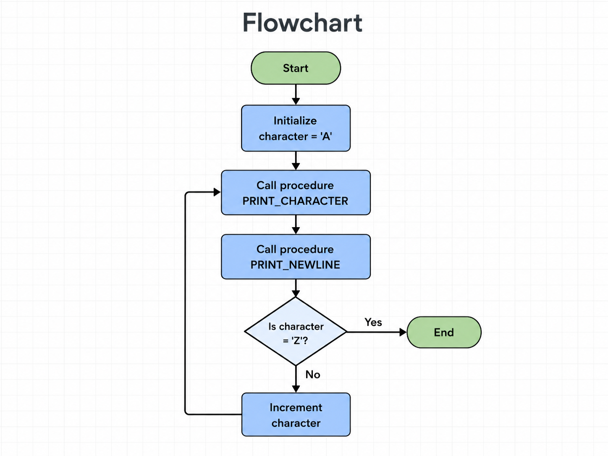

# Procedures Lab

## Objective

Generate English uppercase characters from `A` to `Z`, with a line feed after each character, using procedures and a loop.

## Flowchart



## Assembly Code

```asm
section .data
    character db 'A'       ; stores the current uppercase letter
    newline   db 10        ; ASCII line feed used after each character

section .text
    global _start          ; makes _start visible to the linker

_start:

print_loop:
    ; Display the current character.
    call print_character

    ; Move the cursor to the next line.
    call print_newline

    ; Stop after the letter Z has been printed.
    cmp byte [character], 'Z'
    je exit_program

    ; Move to the next ASCII uppercase character.
    inc byte [character]

    ; Repeat the process for the next letter.
    jmp print_loop

print_character:
    ; Print one character from the character variable.
    mov eax, 4             ; sys_write system call
    mov ebx, 1             ; file descriptor 1 = standard output
    mov ecx, character     ; address of the character to display
    mov edx, 1             ; display exactly one byte
    int 0x80               ; request the kernel to write the character
    ret                    ; return to the instruction after CALL

print_newline:
    ; Print one line-feed character after the letter.
    mov eax, 4             ; sys_write system call
    mov ebx, 1             ; file descriptor 1 = standard output
    mov ecx, newline       ; address of the line-feed character
    mov edx, 1             ; display exactly one byte
    int 0x80               ; request the kernel to write the line feed
    ret                    ; return to the instruction after CALL

exit_program:
    ; End the program after Z has been displayed.
    mov eax, 1             ; sys_exit system call
    mov ebx, 0             ; return status 0 = successful execution
    int 0x80               ; request the kernel to terminate the program

## Challenges

The main challenge was preserving the current character while the output procedures used the system-call registers. Storing the character in memory solved this problem because each procedure could use `EAX`, `EBX`, `ECX`, and `EDX` without losing the current letter.

Another challenge was stopping the loop after printing `Z`. The program compares the current character with `Z` after it is displayed, exits when they match, and otherwise increments the character and repeats.

## Compile and Run

```bash
nasm -f elf32 procedures.asm -o procedures.o
ld -m elf_i386 procedures.o -o procedures
./procedures
```

## Expected Output

```text
A
B
C
D
E
...
Z
```

